# Clusterização de Dados de Sensores de Bomba

#### Aluno: [Hadriel Toledo Lima](https://github.com/hadriellima)
#### Orientadora: [Manoela Kohler](https://github.com/manoelakohler)

---

Trabalho apresentado ao curso [BI MASTER](https://ica.puc-rio.ai/bi-master) como pré-requisito para conclusão de curso e obtenção de crédito na disciplina "Projetos de Sistemas Inteligentes de Apoio à Decisão".

- [Código da Modelagem do Problema](Clustering_Pump_Sensor_Data.ipynb).
- [Código da Análise de Resultados](Results_Analysis.ipynb).

---

### Resumo

### 1. Introdução

O monitoramento preditivo de equipamentos críticos em uma indústria é um processo importante para a continuidade da operação. Quanto mais cedo for possível prever que um equipamento vai falhar, mais tempo as equipes de manutenção tem para impedir que a falha ocorra. É um tema que tem sido objeto de estudo de utilização de aplicação de algoritmos de aprendizado de máquina pois tem potencial de redução de custo de manutenção e, principalmente, diminuir as paradas não programadas na linha de produção. 
A aplicação de métodos de aprendizado de máquina supervisionado é difícil neste tipo de problema porque rotular os dados é uma atividade complexa e de custo alto. Outro problema é que os equipamentos falham pouco e dificilmente será possível obter um rótulos de falhas para todos os problemas possíveis de ocorrer com um equipamento. 
Diante desse cenário tem sido muito utilizado algortimos de detecção de anomalia onde o modelo busca representar o estado de funcionamento normal do equipamento e considera como falha os estados de funcionamento fora do padrão representado no modelo. Como primeira abordagem para o problema é um excelente método pois é uma abordagem mais rápida e barata de ser construída e agrega valor ao processo de manutenção. Porém o algoritmo não é capaz de predizer qual tipo de falha vai ocorrer e  diante da necessidade de evolução no algoritmo de predição de falhas, o custo e a dificuldade de rotular os dados deve ser avaliado.
Na rotualação dos dados neste tipo de problema, mais importante que o rótular das falhas, é a identificação do período antes da falha em que o processo de falha iniciou. O objetivo 

O objetivo deste trabalho é utilizar métodos de clusterização como uma ferramenta de suporte ao especialista na análise de períodos transientes. 

### 2. Descrição dos dados

A base de dados escolhida para o trabalho foi encontrada no Kaggle com o nome *Pump sensor data for predictive maintenance* [link](https://www.kaggle.com/nphantawee/pump-sensor-data). Possui 220.320 registros de estados de funcionamento de uma bomba de água de abastecimento de uma cidade. Existem apenas 7 registros de falh, como é tipico neste tipo de problema. os atributos são: 
* **Timestamp:** Data, hora, minuto e segundo relativo aos dados. A coleta dos dados foi feita a cada 1 minuto. 
* **52 sensores:**: Valores de 52 sensores nesta bomba anonimizados.
* **machine status:** Status de funcioanmento da máquina com os valores NORMAL, RECOVERING e **BROKEN**. No estudo os valores com RECOVERING foram considerados como de funcionamento normal.  

### 3. Modelagem

Na modelagem foi utilizada a linguagem python com a tulização, principalmente, das biblioteca scikit-learn para modelagem e para visualização dos dados, seaborn, Matplotlib e Pyvis. Há comentários descrevendo o processo de modelagem no [notebook](Clustering_Pump_Sensor_Data.ipynb.ipynb") com código fonte. 

Na análise exploratória foi verificada a presença de valores ausentes, onde foi feito o tratamento de substituí-los pela média. Foi verificado tambpem que o sensor 15 não possui valores e ele foi excluído do modelo. O atributo timestamp também foi removido porem a ordem de ocorrencia foi mantida para utilizar os dados como uma sequencia no modelo. 
Foi verificada que existe correlação por blocos entre os sensores. Como os sensores estão anonimizados, não é possível tentar encontrar alguma lógica na relação entre eles. Em um trabalho futuro pode ser interessante dividir a base de dados em duas e montar dois modelos utilizando somente os atributos com maior correlação.

No tratamento dos dados foi realizada a normalização dos valores e também a redução de dimensinalidade com PCA. O conjunto de dados foi reduzido aos 3 componetes principais. 

Foram testados dois algoritmos de clusterização K-Means e Meanshift com variações nos parâmentros de entrada. A ideia é fazer com que cada cluster represente um estado de funcionamento do equipamento. Foi utilizada a biblioteca scikit-learn onde é possível encontrar um bom material prático sobre o funcionamento dos algoritmos ([link](https://scikit-learn.org/stable/modules/clustering.html)). 

O algoritmo **K-Means** agrupa os dados tentando separar amostras em **k** grupos de variância igual, minimizando a inércia (soma dos quadrados dentro do cluster). Este algoritmo requer que o número de clusters seja especificado, parâmentro **k**. Ele se adapta bem a um grande número de amostras como é nosso caso de estudo. Foram testados os parâmetros **k** 10, 100 e 200.  Além da variação do **k**, o algoritmo foi testado com o conjunto de dados completo, sem a redução de dimensionalidade. 

O algoritmo **MeanShift** procura descobrir bolhas em uma densidade uniforme de amostras. É um algoritmo baseado em centróide, que funciona atualizando candidatos a centróides para serem a média dos pontos dentro de uma determinada região. O algoritmo define automaticamente o número de clusters com a configfuração do parâmetro bandwidth  (largura de banda) que determina o tamanho da região a ser pesquisada. É possível que o parâmetro seja estimado, porém neste trabalho os valores foram determinados manualemnte para avaliar o impacto da variação do parâmetro no número de clusters. Foram utilizados os valores 0,175, 0,05 e 0,01 nos testes. o número de clusters é mostrado na tabela a seguir. 

Bandwidth | Número de clusters
------------ | -------------
0,175 | 60
0,05 | 794
0,01 | 39450

### 4. Resultados

#### K-Means

O algoritmo K-Means foi testado com a base de dados antes da redução de dimensionalidade e após a redução de dimensionalidade. Avaliando o gráfico em 3d, ondes os eixos são os valores dos componentes principais e as cores representam cos clusters resultados do algoritmo, é possível notar uma grande proximidade entre os resultados antes e após a redução de dimensionalidade em cada variação do parâmetro k. 

##### k=10 antes da redução de dimensionalidade
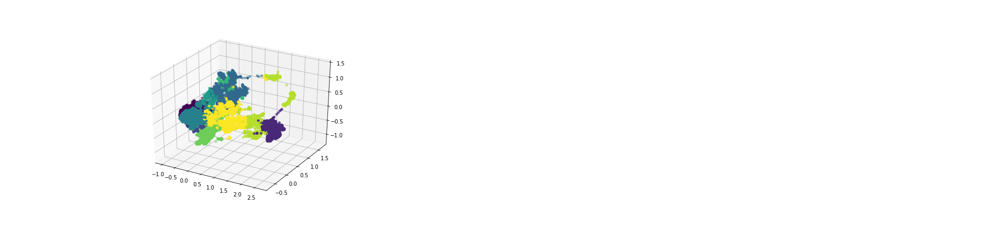

##### k=10 depois da redução de dimensionalidade
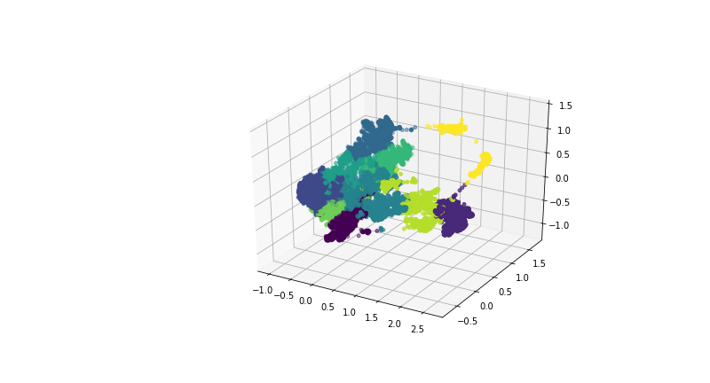

##### k=100 antes da redução de dimensionalidade
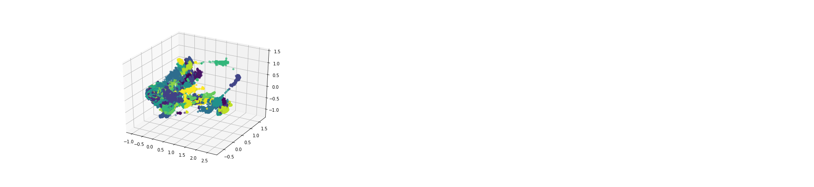

##### k=100 depois da redução de dimensionalidade
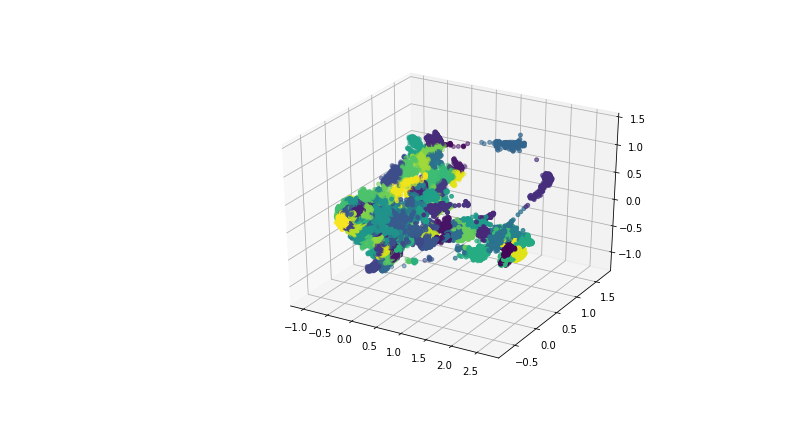

##### k=200 antes da redução de dimensionalidade
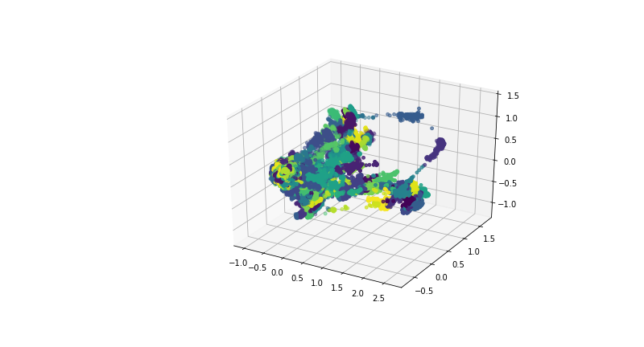

##### k=200 depois da redução de dimensionalidade
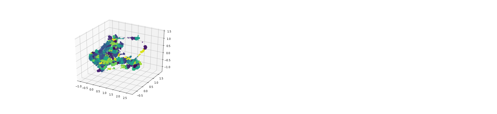

Para cada conjunto de teste, foi plotado um grafo direcionado onde os nós representam os clusters obtidos nos algoritmos e as arestas simbolizam uma mudança de um cluster para o outro. Por exemplo, na imagem a seguir há uma aresta partindo do nó 10 para o nó 7, o que significa que na sequencia dos dados, houve uma transição do cluster 10 para o cluster 7. Na aresta foi incluído um contador da quantidade que a transição entre os cluster ocorreu, no caso do exemplo, oorreu 1 vez. Os nós vermelhos simbolizam clusters com status de falha. Na pasta [output](output) há um conjunto de arquivos html onde é possível navegar pelos grafos obtidos. 

##### Exemplo de grafo com o resultado de um algoritmo de clusterização. 
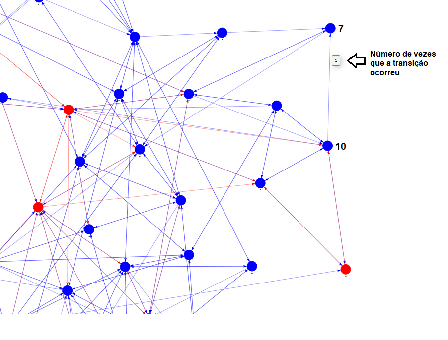

Com o algoritmo K-Means é nítido como a escolha antecipada do parâmetro k é ruim para a abordagem. Com k = 10, os registros de falha não conseguem ser isolados dos registros com funcionamento normal. Com o aumento do número de clusters, o algoritmo consegue isolar os registros de falha, como pode ser visto nas figuras com os grafos nas imagens a seguir. 

##### Grafo K-Means com k=10
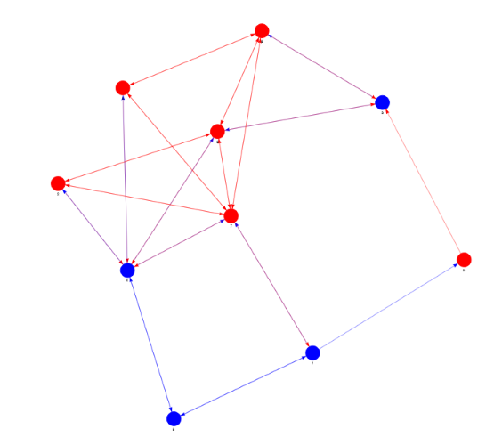

##### Grafo K-Means com k=100
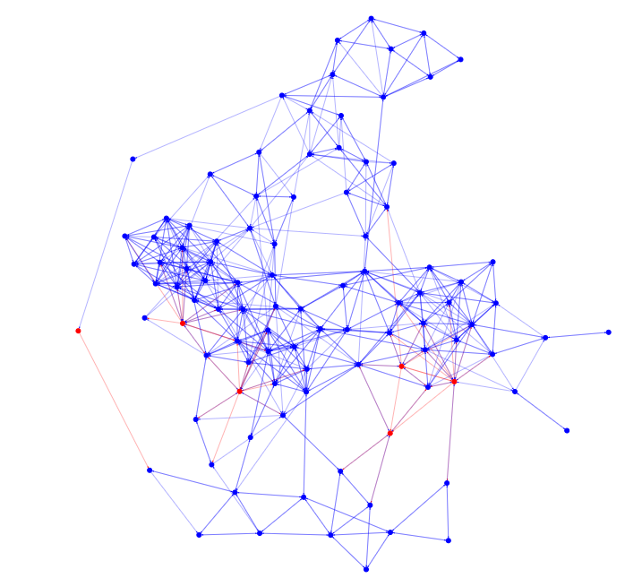

##### Grafo K-Means com k=200
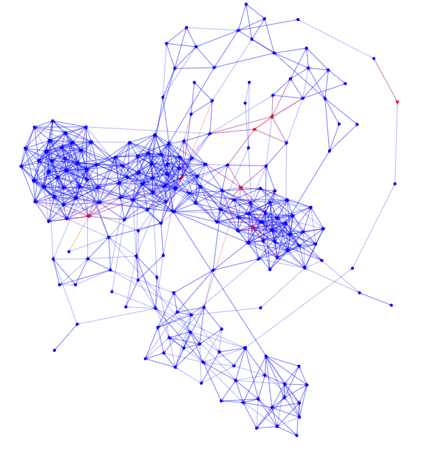

Mesmo com a dificuldade na escolha de k foi possível identificar a situação buscada neste trabalho com os valores 100 e 200. Estas situações foram destacadas nas imagens a seguir. Com k=100, o cluster 13 precedeu o cluster onde houve falha 32. Isto faz deste cluster um periodo transiente candidato. Com k=200, o cluster de falha 111, foi precedido pelos clusters 13 que por sua vez foi precedido unicamente pelo 188. Os dois tambepm clusters são transientes candidatos e neste segundo caso com potencial de antecipar até em dois passos a falha. 

##### Análise Grafo K-Means com k=100
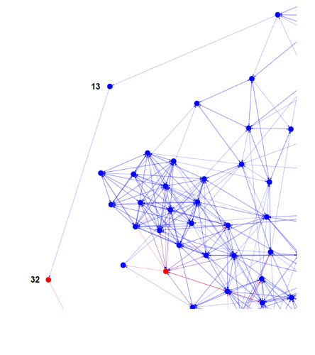

##### Análise Grafo K-Means com k=200
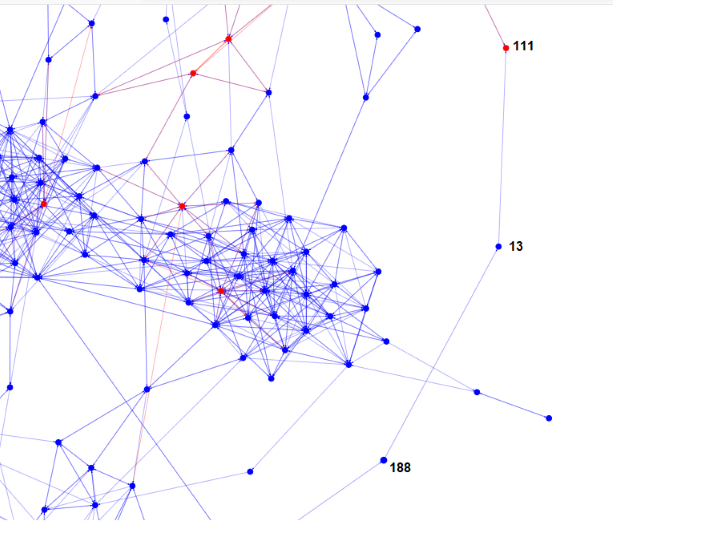

### 5. Conclusão

---

Matrícula: 192.671.068

Pontifícia Universidade Católica do Rio de Janeiro

Curso de Pós Graduação *Business Intelligence Master*
